FDMS: Fast Document Management System - Specification
================================================================

## Executive Summary

FDMS (Fast Document Management System) is a revolutionary document management platform that creates dedicated PostgreSQL tables for each document blueprint, enabling unprecedented query performance and direct database analytics. Unlike traditional systems that store structured data in JSONB blobs, FDMS treats the backend as a specialized database administration tool, dynamically managing schemas while providing a user-friendly interface for non-technical users.

**Key Differentiators:**

- **Table-per-Blueprint Architecture**: Each document type gets its own optimized PostgreSQL table
- **Dynamic Schema Management**: Real-time schema evolution with intelligent migration strategies
- **Direct SQL Access**: Enable BI tools and analytics directly on the database
- **Zero-ETL Analytics**: No need for data warehousing - query production data directly
- **Type-Safe Data Storage**: Database-level constraints ensure data integrity

## Core Architecture Principles

### 1. Separate Table per Blueprint

Each blueprint corresponds to a physical table (e.g., "Employee Registration" → `employee_registration_documents`). This provides:

- **Maximum Performance**: Native SQL queries with proper indexing
- **Data Integrity**: Database-level constraints and foreign keys
- **BI Tool Integration**: Direct connection to business intelligence tools
- **Audit Compliance**: Table-level permissions and triggers

### 2. Dynamic Schema Management

The `SchemaManagerService` handles complex schema evolution:

- **Safe Migrations**: Non-destructive changes via `ALTER TABLE`
- **Type Casting**: Compatible type changes with automatic conversion
- **Incompatible Changes**: Column renaming strategy preserves historical data
- **Rollback Capability**: Full migration rollback with version restoration

### 3. Backend as Database Admin Tool

The Fastify backend functions as a sophisticated database administration interface:

- **DDL Generation**: Automatic `CREATE TABLE` and `ALTER TABLE` statements
- **Query Building**: Dynamic SQL construction with Knex.js
- **Permission Enforcement**: Multi-level access control
- **Transaction Management**: ACID compliance across operations

## Concepts

### User Management & Security

**User Roles**: System-level access rules defining operational capabilities

- `super_admin`: Full system access, blueprint creation/deletion
- `blueprint_admin`: Blueprint design and management
- `data_manager`: Document CRUD within assigned blueprints
- `viewer`: Read-only access to permitted documents
- `auditor`: Access to activity logs and version history

**Groups**: Document-level access rules with inheritance

- Hierarchical group structure (departments, teams, projects)
- Permission inheritance from parent groups
- Dynamic group membership based on attributes
- Time-bound access with automatic expiration

**Multi-Level Permissions Matrix**:

```
Level 1: Blueprint Access (can user see this blueprint?)
Level 2: Document Access (can user access these specific documents?)
Level 3: Stage Access (can user perform actions in this workflow stage?)
Level 4: Section Access (can user view/edit this form section?)
```

**Permission Examples**:

```json
{
  "blueprint_permissions": {
    "hr_documents": {
      "admin_group": ["read", "create", "update", "delete", "manage_stages"],
      "hr_staff": ["read", "create", "update", "stage.draft", "stage.review"],
      "employees": ["read.own", "create.own", "update.own.draft"]
    }
  },
  "stage_permissions": {
    "draft": ["hr_staff", "employees"],
    "review": ["hr_managers"],
    "approved": ["hr_directors"],
    "archived": ["system_admin"]
  }
}
```

### Blueprint System Enhanced

**Blueprints**: Master templates defining document structure

- Unique code identifier (immutable after creation)
- Display title and description
- Associated database table name
- TBD: Lifecycle management (draft, active, deprecated, archived)
- TBD: Cloning and templating capabilities
- TBD: Category and tag system for organization
- TBD: Usage analytics and performance metrics

## Field Types

### Basic Input Fields

**Text Fields**:

```json
{
  "short_text": {
    "database_type": "VARCHAR(n)",
    "ui_component": "TextInput",
    "configuration": {
      "max_length": { "type": "integer", "default": 255 },
      "min_length": { "type": "integer", "default": 0 },
      "pattern": { "type": "string", "description": "Regex pattern" },
      "placeholder": { "type": "string" },
      "autocomplete": { "type": "boolean", "default": false }
    },
    "validation": {
      "required": { "type": "boolean" },
      "unique": { "type": "boolean" },
      "custom_validation": { "type": "string", "description": "JavaScript function" }
    },
    "examples": {
      "employee_id": {
        "pattern": "^EMP[0-9]{4}$",
        "placeholder": "EMP1234",
        "required": true,
        "unique": true
      },
      "phone_number": {
        "pattern": "^\\+?[1-9]\\d{1,14}$",
        "placeholder": "+1234567890"
      }
    }
  },
  "long_text": {
    "database_type": "TEXT",
    "ui_component": "TextArea",
    "configuration": {
      "max_length": { "type": "integer", "default": 10000 },
      "rows": { "type": "integer", "default": 4 },
      "rich_text": { "type": "boolean", "default": false },
      "spell_check": { "type": "boolean", "default": true }
    },
    "examples": {
      "job_description": {
        "max_length": 2000,
        "rows": 6,
        "rich_text": true
      },
      "incident_report": {
        "max_length": 5000,
        "required": true
      }
    }
  }
}
```

**Numeric Fields**:

```json
{
  "integer": {
    "database_type": "BIGINT",
    "ui_component": "NumberInput",
    "configuration": {
      "min_value": { "type": "integer" },
      "max_value": { "type": "integer" },
      "step": { "type": "integer", "default": 1 },
      "thousand_separator": { "type": "boolean", "default": true }
    },
    "examples": {
      "employee_count": {
        "min_value": 0,
        "max_value": 100000,
        "step": 1
      },
      "salary": {
        "min_value": 0,
        "max_value": 1000000,
        "thousand_separator": true
      }
    }
  },
  "decimal": {
    "database_type": "NUMERIC(precision, scale)",
    "ui_component": "DecimalInput",
    "configuration": {
      "precision": { "type": "integer", "default": 10 },
      "scale": { "type": "integer", "default": 2 },
      "min_value": { "type": "number" },
      "max_value": { "type": "number" }
    },
    "examples": {
      "hourly_rate": {
        "precision": 8,
        "scale": 2,
        "min_value": 0,
        "max_value": 999.99
      },
      "percentage": {
        "precision": 5,
        "scale": 2,
        "min_value": 0,
        "max_value": 100
      }
    }
  }
}
```

### Advanced Field Types

**Geospatial Fields**:

```json
{
  "point": {
    "database_type": "GEOMETRY(Point, 4326)",
    "ui_component": "MapPointSelector",
    "configuration": {
      "default_lat": { "type": "number" },
      "default_lng": { "type": "number" },
      "default_zoom": { "type": "integer", "default": 10 },
      "bounds": {
        "type": "object",
        "properties": {
          "north": { "type": "number" },
          "south": { "type": "number" },
          "east": { "type": "number" },
          "west": { "type": "number" }
        }
      },
      "address_autocomplete": { "type": "boolean", "default": true }
    },
    "validation": {
      "within_bounds": { "type": "boolean" },
      "required_precision": { "type": "number", "description": "Minimum accuracy in meters" }
    },
    "examples": {
      "property_location": {
        "default_lat": 40.7128,
        "default_lng": -74.0060,
        "bounds": {
          "north": 40.9176,
          "south": 40.4774,
          "east": -73.7004,
          "west": -74.2591
        },
        "required_precision": 10
      }
    }
  },
  "polygon": {
    "database_type": "GEOMETRY(Polygon, 4326)",
    "ui_component": "MapPolygonDrawer",
    "configuration": {
      "max_vertices": { "type": "integer", "default": 100 },
      "min_area": { "type": "number", "description": "Minimum area in square meters" },
      "max_area": { "type": "number", "description": "Maximum area in square meters" },
      "allow_holes": { "type": "boolean", "default": false }
    },
    "validation": {
      "no_self_intersection": { "type": "boolean", "default": true },
      "area_limits": { "type": "boolean" }
    }
  }
}
```

**Composite Objects**:

```json
{
  "composite_object": {
    "database_type": "JSONB",
    "ui_component": "ObjectEditor",
    "configuration": {
      "nested_fields": {
        "type": "object",
        "description": "Object defining the structure of nested fields"
      },
      "display_mode": {
        "type": "string",
        "enum": ["modal", "inline", "accordion"],
        "default": "modal"
      },
      "collapsible": { "type": "boolean", "default": true }
    },
    "examples": {
      "address": {
        "nested_fields": {
          "street_address": { "type": "short_text", "required": true },
          "city": { "type": "short_text", "required": true },
          "state": { "type": "single_select", "source": "states" },
          "postal_code": { "type": "short_text", "pattern": "^[0-9]{5}(-[0-9]{4})?$" },
          "country": { "type": "single_select", "source": "countries", "default": "US" }
        },
        "display_mode": "inline"
      },
      "emergency_contact": {
        "nested_fields": {
          "name": { "type": "short_text", "required": true },
          "relationship": { "type": "single_select", "options": ["Spouse", "Parent", "Sibling", "Friend", "Other"] },
          "phone": { "type": "short_text", "pattern": "phone" },
          "email": { "type": "short_text", "pattern": "email" }
        },
        "display_mode": "modal"
      }
    }
  },
  "array_of_objects": {
    "database_type": "JSONB",
    "ui_component": "ObjectArrayEditor",
    "configuration": {
      "object_template": {
        "type": "object",
        "description": "Template for each object in the array"
      },
      "min_items": { "type": "integer", "default": 0 },
      "max_items": { "type": "integer", "default": 100 },
      "sortable": { "type": "boolean", "default": true },
      "display_as": {
        "type": "string",
        "enum": ["table", "cards", "list"],
        "default": "table"
      }
    },
    "examples": {
      "work_experience": {
        "object_template": {
          "company_name": { "type": "short_text", "required": true },
          "position": { "type": "short_text", "required": true },
          "start_date": { "type": "date", "required": true },
          "end_date": { "type": "date" },
          "current_position": { "type": "checkbox" },
          "responsibilities": { "type": "long_text", "max_length": 1000 },
          "salary": { "type": "currency" }
        },
        "min_items": 1,
        "max_items": 10,
        "display_as": "cards"
      },
      "education": {
        "object_template": {
          "institution": { "type": "short_text", "required": true },
          "degree": { "type": "single_select", "options": ["High School", "Associate", "Bachelor", "Master", "Doctorate"] },
          "field_of_study": { "type": "short_text" },
          "graduation_year": { "type": "integer", "min_value": 1950, "max_value": 2030 },
          "gpa": { "type": "decimal", "precision": 3, "scale": 2, "min_value": 0, "max_value": 4 }
        },
        "display_as": "table"
      }
    }
  }
}
```

### Output Field Types

**Formula Fields**:

```json
{
  "formula": {
    "database_type": "COMPUTED",
    "ui_component": "FormulaDisplay",
    "configuration": {
      "expression": {
        "type": "string",
        "description": "JavaScript expression for calculation"
      },
      "dependencies": {
        "type": "array",
        "items": { "type": "string" },
        "description": "List of field codes this formula depends on"
      },
      "output_type": {
        "type": "string",
        "enum": ["number", "string", "boolean", "date"],
        "default": "number"
      },
      "format": {
        "type": "string",
        "description": "Display format (e.g., currency, percentage, date format)"
      },
      "update_trigger": {
        "type": "string",
        "enum": ["on_change", "on_save", "manual"],
        "default": "on_change"
      }
    },
    "security": {
      "sandbox": true,
      "allowed_functions": ["Math", "Date", "parseFloat", "parseInt"],
      "execution_timeout": 5000
    },
    "examples": {
      "total_compensation": {
        "expression": "base_salary + (base_salary * bonus_percentage / 100) + benefits_value",
        "dependencies": ["base_salary", "bonus_percentage", "benefits_value"],
        "output_type": "number",
        "format": "currency"
      },
      "employment_duration": {
        "expression": "Math.ceil((end_date || new Date() - start_date) / (1000 * 60 * 60 * 24 * 365.25))",
        "dependencies": ["start_date", "end_date"],
        "output_type": "number",
        "format": "years"
      },
      "full_name": {
        "expression": "[first_name, middle_name, last_name].filter(Boolean).join(' ')",
        "dependencies": ["first_name", "middle_name", "last_name"],
        "output_type": "string"
      }
    }
  }
}
```

**Template Generation Fields**:

```json
{
  "pdf_template": {
    "ui_component": "PDFGenerator",
    "configuration": {
      "template_file": { "type": "string", "description": "Path to template file" },
      "page_format": { "type": "string", "enum": ["A4", "Letter", "Legal"], "default": "A4" },
      "orientation": { "type": "string", "enum": ["portrait", "landscape"], "default": "portrait" },
      "include_watermark": { "type": "boolean", "default": false },
      "password_protect": { "type": "boolean", "default": false }
    },
    "libraries": {
      "primary": "jsPDF",
      "alternatives": ["PDFKit", "Puppeteer"]
    },
    "examples": {
      "employee_contract": {
        "template_file": "templates/employee_contract.html",
        "page_format": "Letter",
        "include_watermark": true,
        "password_protect": true
      },
      "performance_review": {
        "template_file": "templates/performance_review.html",
        "page_format": "A4"
      }
    }
  },
  "docx_template": {
    "ui_component": "DOCXGenerator", 
    "configuration": {
      "template_file": { "type": "string", "description": "Path to DOCX template" },
      "placeholder_syntax": { "type": "string", "default": "{field_name}" },
      "include_tables": { "type": "boolean", "default": true },
      "include_images": { "type": "boolean", "default": true }
    },
    "libraries": {
      "primary": "docxtemplater",
      "alternatives": ["docx-templates"]
    },
    "examples": {
      "offer_letter": {
        "template_file": "templates/offer_letter.docx",
        "placeholder_syntax": "{{field_name}}"
      }
    }
  }
}
```

## Advanced Schema Migration Strategies

### Migration Classification System

**Migration Types**:

1. **Green (Safe)**: No data loss risk
   - Adding new columns
   - Lengthening VARCHAR fields
   - Adding indexes
   - Adding constraints (with validation)

2. **Yellow (Caution)**: Potential data transformation
   - Type casting between compatible types
   - Renaming columns
   - Changing precision/scale of numeric fields
   - Converting between similar types (TEXT ↔ VARCHAR)

3. **Red (Destructive)**: High risk of data loss
   - Changing incompatible types (TEXT → INTEGER)
   - Removing columns
   - Shortening VARCHAR fields
   - Adding NOT NULL constraints to existing columns

### Migration Implementation

**Green Migrations**:

```sql
-- Adding a new column (safe)
ALTER TABLE employee_documents 
ADD COLUMN emergency_contact_phone VARCHAR(20);

-- Lengthening VARCHAR (safe)
ALTER TABLE employee_documents 
ALTER COLUMN email TYPE VARCHAR(500);

-- Adding index (safe, use CONCURRENTLY in production)
CREATE INDEX CONCURRENTLY idx_employee_hire_date 
ON employee_documents(hire_date);
```

**Yellow Migrations**:

```sql
-- Type casting with validation
DO $$
BEGIN
    -- Check if all values can be converted
    IF EXISTS (
        SELECT 1 FROM employee_documents 
        WHERE salary_text !~ '^[0-9]+(\.[0-9]{1,2})?$'
    ) THEN
        RAISE EXCEPTION 'Invalid salary values found. Manual cleanup required.';
    END IF;
    
    -- Perform the migration
    ALTER TABLE employee_documents 
    ALTER COLUMN salary_text TYPE NUMERIC(10,2) 
    USING salary_text::NUMERIC(10,2);
END $$;
```

**Red Migrations** (with backup strategy):

```sql
-- Backup strategy for destructive changes
BEGIN;

-- Step 1: Create backup column
ALTER TABLE employee_documents 
ADD COLUMN notes_backup TEXT;

-- Step 2: Copy existing data
UPDATE employee_documents 
SET notes_backup = notes;

-- Step 3: Attempt conversion (if applicable)
ALTER TABLE employee_documents 
ADD COLUMN notes_new INTEGER;

UPDATE employee_documents 
SET notes_new = CASE 
    WHEN notes ~ '^[0-9]+$' THEN notes::INTEGER 
    ELSE NULL 
END;

-- Step 4: Replace original column
ALTER TABLE employee_documents DROP COLUMN notes;
ALTER TABLE employee_documents RENAME COLUMN notes_new TO notes;

-- Step 5: Document the migration
INSERT INTO blueprint_versions (blueprint_id, data, diff) 
VALUES (
    1, 
    '{"migration": "notes_text_to_integer"}',
    'Changed notes field from TEXT to INTEGER. Backup preserved in notes_backup column.'
);

COMMIT;
```

### Schema Evolution Tracking

**Version Management**:

```json
{
  "blueprint_version": {
    "version_number": "1.3.0",
    "changes": [
      {
        "type": "field_addition",
        "field_code": "emergency_contact",
        "field_type": "composite_object",
        "migration_risk": "green"
      },
      {
        "type": "field_type_change", 
        "field_code": "salary",
        "old_type": "short_text",
        "new_type": "currency",
        "migration_risk": "yellow",
        "validation_query": "SELECT COUNT(*) FROM {table} WHERE salary !~ '^[0-9]+(\\.[0-9]{2})?$'"
      }
    ],
    "migration_script": "migrations/employee_v1_3_0.sql",
    "rollback_script": "rollbacks/employee_v1_3_0_rollback.sql"
  }
}
```

## Use Cases

### Use Case 1: HR Employee Onboarding System

**Blueprint Structure**:

```json
{
  "blueprint": {
    "code": "employee_onboarding",
    "title": "Employee Onboarding",
    "table_name": "employee_onboarding_documents",
    "sections": [
      {
        "code": "personal_info",
        "title": "Personal Information",
        "sequence": 1,
        "required_for_stages": ["draft", "review"]
      },
      {
        "code": "employment_details", 
        "title": "Employment Details",
        "sequence": 2,
        "required_for_stages": ["review", "hr_approval"]
      },
      {
        "code": "benefits_selection",
        "title": "Benefits Selection", 
        "sequence": 3,
        "required_for_stages": ["hr_approval", "completed"]
      },
      {
        "code": "documents_compliance",
        "title": "Required Documents",
        "sequence": 4,
        "required_for_stages": ["completed"]
      }
    ],
    "stages": [
      {
        "code": "draft",
        "title": "Employee Draft",
        "sequence": 1,
        "permissions": ["employee", "hr_staff"],
        "auto_advance": false
      },
      {
        "code": "review",
        "title": "Manager Review",
        "sequence": 2,
        "permissions": ["manager", "hr_staff"],
        "auto_advance": false,
        "required_sections": ["personal_info", "employment_details"]
      },
      {
        "code": "hr_approval",
        "title": "HR Approval",
        "sequence": 3,
        "permissions": ["hr_manager"],
        "auto_advance": false,
        "required_sections": ["personal_info", "employment_details", "benefits_selection"]
      },
      {
        "code": "completed",
        "title": "Onboarding Complete",
        "sequence": 4,
        "permissions": ["hr_staff"],
        "auto_advance": true,
        "required_sections": ["personal_info", "employment_details", "benefits_selection", "documents_compliance"],
        "completion_actions": ["generate_welcome_packet", "create_system_accounts", "notify_payroll"]
      }
    ],
    "fields": {
      "employee_id": {
        "section": "personal_info",
        "type": "short_text",
        "title": "Employee ID",
        "required": true,
        "unique": true,
        "pattern": "^EMP[0-9]{4}$",
        "auto_generate": true,
        "generation_pattern": "EMP{####}"
      },
      "personal_info": {
        "section": "personal_info",
        "type": "composite_object",
        "title": "Personal Information",
        "required": true,
        "nested_fields": {
          "first_name": { "type": "short_text", "required": true },
          "middle_name": { "type": "short_text" },
          "last_name": { "type": "short_text", "required": true },
          "date_of_birth": { "type": "date", "required": true },
          "ssn": { "type": "short_text", "pattern": "^[0-9]{3}-[0-9]{2}-[0-9]{4}$", "encrypted": true },
          "phone": { "type": "short_text", "pattern": "phone" },
          "personal_email": { "type": "short_text", "pattern": "email", "required": true }
        }
      },
      "home_address": {
        "section": "personal_info",
        "type": "composite_object", 
        "title": "Home Address",
        "required": true,
        "nested_fields": {
          "street_address": { "type": "short_text", "required": true },
          "city": { "type": "short_text", "required": true },
          "state": { "type": "single_select", "source": "us_states", "required": true },
          "zip_code": { "type": "short_text", "pattern": "^[0-9]{5}(-[0-9]{4})?$", "required": true }
        }
      },
      "emergency_contacts": {
        "section": "personal_info",
        "type": "array_of_objects",
        "title": "Emergency Contacts",
        "min_items": 1,
        "max_items": 3,
        "object_template": {
          "name": { "type": "short_text", "required": true },
          "relationship": { "type": "single_select", "options": ["Spouse", "Parent", "Sibling", "Child", "Friend", "Other"] },
          "phone": { "type": "short_text", "pattern": "phone", "required": true },
          "email": { "type": "short_text", "pattern": "email" }
        }
      },
      "position_details": {
        "section": "employment_details",
        "type": "composite_object",
        "title": "Position Details",
        "required": true,
        "nested_fields": {
          "job_title": { "type": "short_text", "required": true },
          "department": { "type": "foreign_key", "target": "departments", "required": true },
          "manager": { "type": "foreign_key", "target": "employees", "required": true },
          "employment_type": { "type": "single_select", "options": ["Full-time", "Part-time", "Contract", "Intern"] },
          "start_date": { "type": "date", "required": true },
          "salary": { "type": "currency", "currency": "USD", "required": true },
          "pay_frequency": { "type": "single_select", "options": ["Weekly", "Bi-weekly", "Monthly"] }
        }
      },
      "benefits_elections": {
        "section": "benefits_selection",
        "type": "composite_object",
        "title": "Benefits Elections",
        "nested_fields": {
          "health_insurance": { "type": "single_select", "source": "health_plans" },
          "dental_insurance": { "type": "single_select", "source": "dental_plans" },
          "vision_insurance": { "type": "checkbox" },
          "retirement_contribution": { "type": "decimal", "min_value": 0, "max_value": 25, "suffix": "%" },
          "beneficiaries": {
            "type": "array_of_objects",
            "object_template": {
              "name": { "type": "short_text", "required": true },
              "relationship": { "type": "short_text", "required": true },
              "percentage": { "type": "decimal", "min_value": 0, "max_value": 100, "suffix": "%" }
            }
          }
        }
      },
      "required_documents": {
        "section": "documents_compliance",
        "type": "composite_object",
        "title": "Required Documents",
        "nested_fields": {
          "i9_form": { "type": "single_file", "required": true, "allowed_types": [".pdf"] },
          "id_verification": { "type": "multiple_files", "required": true, "max_files": 2 },
          "tax_forms": { "type": "multiple_files", "allowed_types": [".pdf", ".jpg", ".png"] },
          "direct_deposit": { "type": "single_file", "allowed_types": [".pdf"] }
        }
      },
      "welcome_packet": {
        "section": "documents_compliance",
        "type": "pdf_template",
        "title": "Welcome Packet",
        "template": "templates/employee_welcome_packet.html",
        "auto_generate": true,
        "generate_on_stage": "completed"
      }
    },
    "validation_rules": [
      {
        "rule": "benefits_total_percentage",
        "expression": "benefits_elections.beneficiaries.reduce((sum, b) => sum + b.percentage, 0) === 100",
        "error_message": "Beneficiary percentages must total 100%",
        "applies_to_stages": ["hr_approval", "completed"]
      },
      {
        "rule": "start_date_future",
        "expression": "position_details.start_date >= new Date()",
        "error_message": "Start date must be in the future",
        "applies_to_stages": ["review", "hr_approval"]
      }
    ],
    "automation_rules": [
      {
        "trigger": "stage_change",
        "from_stage": "hr_approval",
        "to_stage": "completed",
        "actions": [
          "create_system_accounts",
          "notify_it_department",
          "schedule_orientation",
          "update_org_chart"
        ]
      }
    ]
  }
}
```

**Generated Database Table**:

```sql
CREATE TABLE employee_onboarding_documents (
    id SERIAL PRIMARY KEY,
    blueprint_id INT NOT NULL REFERENCES blueprints(id),
    current_stage_id INT REFERENCES blueprint_stages(id),
    created_by INT NOT NULL REFERENCES users(id),
    updated_by INT REFERENCES users(id),
    created_at TIMESTAMPTZ NOT NULL DEFAULT NOW(),
    updated_at TIMESTAMPTZ NOT NULL DEFAULT NOW(),
    
    -- Generated fields from blueprint
    employee_id VARCHAR(8) UNIQUE NOT NULL,
    personal_info JSONB NOT NULL,
    home_address JSONB NOT NULL,
    emergency_contacts JSONB NOT NULL,
    position_details JSONB NOT NULL,
    benefits_elections JSONB,
    required_documents JSONB,
    
    -- Computed fields
    full_name VARCHAR GENERATED ALWAYS AS ((personal_info->>'first_name') || ' ' || (personal_info->>'last_name')) STORED,
    department_id INT GENERATED ALWAYS AS ((position_details->>'department')::INT) STORED,
    start_date DATE GENERATED ALWAYS AS ((position_details->>'start_date')::DATE) STORED,
    
    -- Search and filtering
    search_vector TSVECTOR GENERATED ALWAYS AS (
        to_tsvector('english', COALESCE(personal_info->>'first_name', '') || ' ' || 
                              COALESCE(personal_info->>'last_name', '') || ' ' ||
                              COALESCE(position_details->>'job_title', '') || ' ' ||
                              employee_id)
    ) STORED
);

-- Indexes for performance
CREATE INDEX idx_employee_onboarding_stage ON employee_onboarding_documents(current_stage_id);
CREATE INDEX idx_employee_onboarding_department ON employee_onboarding_documents(department_id);
CREATE INDEX idx_employee_onboarding_start_date ON employee_onboarding_documents(start_date);
CREATE INDEX idx_employee_onboarding_search ON employee_onboarding_documents USING GIN(search_vector);
CREATE INDEX idx_employee_onboarding_created_by ON employee_onboarding_documents(created_by);

-- Version table
CREATE TABLE employee_onboarding_document_versions (
    id SERIAL PRIMARY KEY,
    document_id INT NOT NULL REFERENCES employee_onboarding_documents(id),
    data JSONB NOT NULL,
    diff JSONB,
    created_by INT REFERENCES users(id),
    created_at TIMESTAMPTZ NOT NULL DEFAULT NOW()
);
```

## API Design & Implementation

### RESTful API Structure

**Blueprint Management**:

```typescript
// GET /api/blueprints
interface BlueprintListResponse {
  blueprints: Array<{
    id: number;
    code: string;
    title: string;
    description?: string;
    status: 'draft' | 'active' | 'deprecated' | 'archived';
    created_at: string;
    updated_at: string;
    document_count: number;
    version: string;
  }>;
  total: number;
  page: number;
  per_page: number;
}

// POST /api/blueprints
interface CreateBlueprintRequest {
  code: string;
  title: string;
  description?: string;
  sections: Array<{
    code: string;
    title: string;
    sequence: number;
  }>;
  stages: Array<{
    code: string;
    title: string;
    sequence: number;
    permissions: string[];
  }>;
  fields: Array<{
    code: string;
    title: string;
    type: string;
    section_code: string;
    config: Record<string, any>;
    required: boolean;
  }>;
}

// GET /api/blueprints/:id/schema
interface BlueprintSchemaResponse {
  blueprint: {
    id: number;
    code: string;
    title: string;
    table_name: string;
  };
  sections: Array<{
    code: string;
    title: string;
    sequence: number;
    fields: Array<{
      code: string;
      title: string;
      type: string;
      config: Record<string, any>;
      validation: Record<string, any>;
      required: boolean;
    }>;
  }>;
  stages: Array<{
    code: string;
    title: string;
    sequence: number;
    permissions: string[];
  }>;
}
```

**Document Operations**:

```typescript
// GET /api/documents/:blueprint_code
interface DocumentListRequest {
  page?: number;
  per_page?: number;
  stage?: string;
  created_by?: number;
  search?: string;
  sort_by?: string;
  sort_order?: 'asc' | 'desc';
  date_from?: string;
  date_to?: string;
  filters?: Record<string, any>;
}

interface DocumentListResponse {
  documents: Array<{
    id: number;
    created_at: string;
    updated_at: string;
    current_stage: {
      code: string;
      title: string;
    };
    created_by: {
      id: number;
      email: string;
      full_name: string;
    };
    summary_fields: Record<string, any>; // Key fields for list display
  }>;
  total: number;
  page: number;
  per_page: number;
  facets: Record<string, Array<{ value: string; count: number }>>;
}

// POST /api/documents/:blueprint_code
interface CreateDocumentRequest {
  field_values: Record<string, any>;
  auto_advance?: boolean;
}

// PUT /api/documents/:blueprint_code/:id
interface UpdateDocumentRequest {
  field_values: Record<string, any>;
  stage_action?: {
    action: 'advance' | 'reject' | 'hold';
    comment?: string;
    notify_users?: number[];
  };
}

// GET /api/documents/:blueprint_code/:id
interface DocumentDetailResponse {
  document: {
    id: number;
    created_at: string;
    updated_at: string;
    current_stage: {
      code: string;
      title: string;
      sequence: number;
    };
    created_by: {
      id: number;
      email: string;
      full_name: string;
    };
    field_values: Record<string, any>;
    computed_values: Record<string, any>;
    permissions: {
      can_edit: boolean;
      can_delete: boolean;
      can_advance_stage: boolean;
      editable_sections: string[];
    };
  };
  blueprint_schema: BlueprintSchemaResponse;
  activity_log: Array<{
    id: number;
    action: string;
    user: { id: number; email: string; full_name: string };
    timestamp: string;
    changes?: Record<string, { old: any; new: any }>;
    comment?: string;
  }>;
}
```

**File Management**:

```typescript
// POST /api/files/upload
interface FileUploadRequest {
  files: File[];
  document_id?: number;
  blueprint_code?: string;
  field_code?: string;
}

interface FileUploadResponse {
  files: Array<{
    id: string;
    filename: string;
    original_name: string;
    mime_type: string;
    size: number;
    url: string;
    thumbnail_url?: string;
  }>;
}

// GET /api/files/:file_id
// Downloads the file with proper content disposition headers

// DELETE /api/files/:file_id
// Removes file from storage and updates document references
```

### Advanced Query Capabilities

**Dynamic Filtering**:

```typescript
interface QueryFilter {
  field: string;
  operator: 'eq' | 'ne' | 'gt' | 'gte' | 'lt' | 'lte' | 'in' | 'not_in' | 'like' | 'ilike' | 'is_null' | 'is_not_null' | 'between';
  value: any;
  logic?: 'and' | 'or';
}

// GET /api/documents/:blueprint_code/query
interface AdvancedQueryRequest {
  filters: QueryFilter[];
  sort: Array<{ field: string; direction: 'asc' | 'desc' }>;
  page: number;
  per_page: number;
  include_computed: boolean;
  export_format?: 'json' | 'csv' | 'xlsx';
}

// Example query: Find all employees hired in the last 6 months with salary > $50,000
const query: AdvancedQueryRequest = {
  filters: [
    {
      field: 'position_details.start_date',
      operator: 'gte',
      value: '2024-01-01',
      logic: 'and'
    },
    {
      field: 'position_details.salary',
      operator: 'gt',
      value: 50000,
      logic: 'and'
    }
  ],
  sort: [
    { field: 'position_details.start_date', direction: 'desc' }
  ],
  page: 1,
  per_page: 50,
  include_computed: true
};
```

**Aggregation Queries**:

```typescript
// GET /api/documents/:blueprint_code/aggregate
interface AggregationRequest {
  group_by: string[];
  aggregations: Array<{
    field: string;
    function: 'count' | 'sum' | 'avg' | 'min' | 'max' | 'std_dev';
    alias?: string;
  }>;
  filters?: QueryFilter[];
  having?: QueryFilter[];
}

// Example: Average salary by department
const aggregation: AggregationRequest = {
  group_by: ['position_details.department'],
  aggregations: [
    { field: 'position_details.salary', function: 'avg', alias: 'avg_salary' },
    { field: '*', function: 'count', alias: 'employee_count' }
  ],
  filters: [
    { field: 'current_stage.code', operator: 'eq', value: 'completed' }
  ]
};
```
# ER Diagram

```mermaid
erDiagram
    users {
        int id PK
        string email UK
        string full_name
        string password_hash
        timestamp created_at
        timestamp updated_at
    }

    roles {
        int id PK
        string name UK "e.g., super_admin, blueprint_admin"
    }

    user_roles {
        int user_id PK, FK
        int role_id PK, FK
    }

    groups {
        int id PK
        string name
        int parent_id FK "Self-referencing for hierarchy"
        timestamp created_at
        timestamp updated_at
    }

    user_groups {
        int user_id PK, FK
        int group_id PK, FK
    }

    blueprints {
        int id PK
        string code UK
        string title
        text description
        string table_name "Name of the dedicated document table"
        string status "draft, active, deprecated, archived"
        int extends_blueprint_id FK "For inheritance"
        int created_by_id FK
        timestamp created_at
        timestamp updated_at
    }

    blueprint_versions {
        int id PK
        int blueprint_id FK
        string version_number
        jsonb changes "Details of schema changes"
        text migration_script_up
        text migration_script_down
        timestamp created_at
    }

    sections {
        int id PK
        int blueprint_id FK
        string code UK "Unique within a blueprint"
        string title
        int sequence
    }

    fields {
        int id PK
        int section_id FK
        string code UK "Unique within a blueprint"
        string title
        string type "short_text, integer, composite_object, etc."
        jsonb config "Field-specific configuration"
        jsonb validation "Validation rules for the field"
        boolean required
    }

    blueprint_stages {
        int id PK
        int blueprint_id FK
        string code UK "Unique within a blueprint"
        string title
        int sequence
    }

    documents {
        bigint id PK "Represents a row in a blueprint-specific table"
        int blueprint_id FK
        int current_stage_id FK
        int created_by_id FK
        int updated_by_id FK
        timestamp created_at
        timestamp updated_at
        jsonb data "Stores fields defined in the blueprint"
    }

    document_versions {
        bigint id PK
        bigint document_id FK
        jsonb data "Snapshot of document data"
        jsonb diff "Changes from previous version"
        int created_by_id FK
        timestamp created_at
    }

    files {
        uuid id PK
        string filename
        string original_filename
        string mime_type
        bigint size_bytes
        int uploaded_by_id FK
        timestamp created_at
    }

    document_files {
        bigint document_id PK, FK
        uuid file_id PK, FK
        int field_id PK, FK "Field this file is associated with"
    }

    activity_logs {
        bigint id PK
        bigint document_id FK
        int user_id FK
        string action "e.g., created, updated, stage_changed"
        jsonb changes "Details of the changes made"
        text comment
        timestamp created_at
    }

    permissions {
        int id PK
        int role_id FK
        int group_id FK
        string resource_type "e.g., blueprint, stage, field"
        int resource_id
        string action "e.g., read, create, update, delete"
    }

    validation_rules {
        int id PK
        int blueprint_id FK
        string rule "Unique name for the rule"
        string expression "Validation logic"
        string error_message
        jsonb applies_to_stages
    }

    automation_rules {
        int id PK
        int blueprint_id FK
        string trigger "e.g., stage_change"
        string from_stage
        string to_stage
        jsonb actions "List of actions to perform"
    }

    "users" ||--o{ "user_roles" : "has"
    "roles" ||--o{ "user_roles" : "assigned to"
    "users" ||--o{ "user_groups" : "is member of"
    "groups" ||--o{ "user_groups" : "has"
    "groups" }o--o{ "groups" : "is child of"
    "users" ||--o{ "blueprints" : "created"
    "users" ||--o{ "documents" : "created"
    "users" ||--o{ "documents" : "updated"
    "users" ||--o{ "document_versions" : "created"
    "users" ||--o{ "activity_logs" : "performed"
    "users" ||--o{ "files" : "uploaded"
    "roles" ||--o{ "permissions" : "grants"
    "groups" ||--o{ "permissions" : "grants"
    "blueprints" }o--o{ "blueprints" : "extends"
    "blueprints" ||--|{ "blueprint_versions" : "has history"
    "blueprints" ||--|{ "sections" : "contains"
    "blueprints" ||--|{ "blueprint_stages" : "defines"
    "blueprints" ||--|{ "validation_rules" : "has"
    "blueprints" ||--|{ "automation_rules" : "has"
    "blueprints" ||--o{ "documents" : "instantiates"
    "sections" ||--|{ "fields" : "contains"
    "blueprint_stages" ||--o{ "documents" : "is current for"
    "documents" ||--|{ "document_versions" : "has history"
    "documents" ||--|{ "activity_logs" : "has"
    "documents" ||--o{ "document_files" : "attaches"
    "fields" ||--o{ "document_files" : "is target for"
    "files" ||--o{ "document_files" : "is attached via"
```



This expanded specification provides a comprehensive foundation for building the FDMS system with enterprise-grade capabilities while maintaining the core architectural principles of performance, flexibility, and data integrity. 